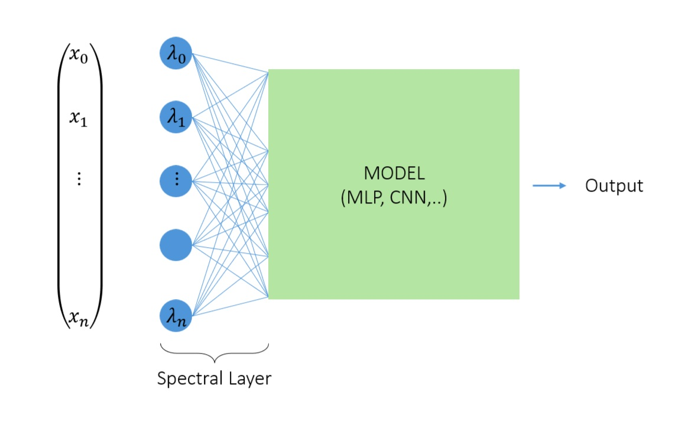

# Spectral Neural Networks for automatic input feature relevance estimation

In this repository is stored the code used in the paper "Automatic Input Feature Relevance via Spectral Neural Networks".

There are four distinct notebooks, one for each dataset considered in this work. Each notebook contains the code for model definition, dataset generation, model training, and result plotting.

In the case of the stellar spectra dataset, a reduced version of the dataset used in the study is provided to test the method.

The method consists of adding a Spectral Layer as the first operation of the model. The Spectral Layer is essentially a Dense Layer with weights parametrized as $w_{ij} = \lambda_i \phi_{ij}$. The parameters $\lambda_i$, referred to as eigenvalues, are node-specific parameters. After training, the values of these parameters serve as good proxies for the relevance of the input components connected to the input layer nodes.

<figure>
    
    <figcaption> \footnotesize Scheme of input feature relevance estimation via Spectral
Neural Networks method. </figcaption>
</figure>

$R(x_i) \propto \lambda_i$, were $R(x_i)$ is the relevance of the component $x_i$.
